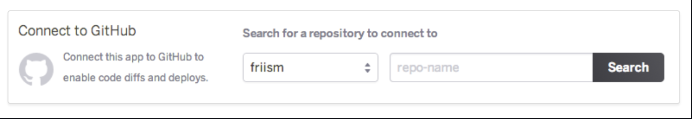
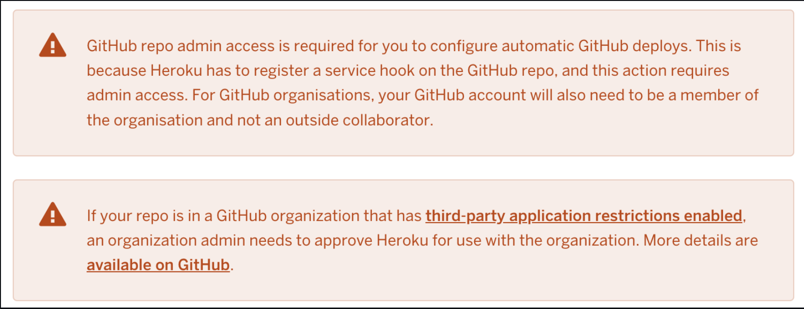
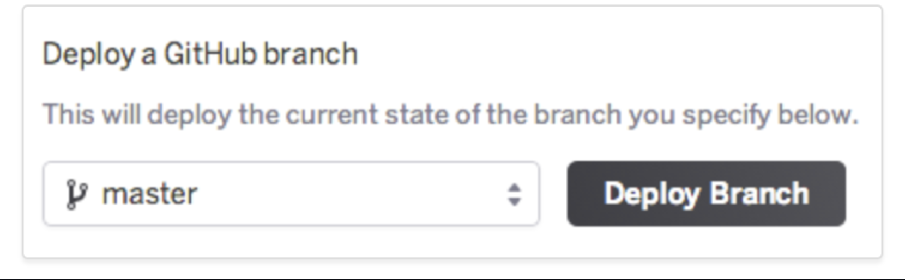
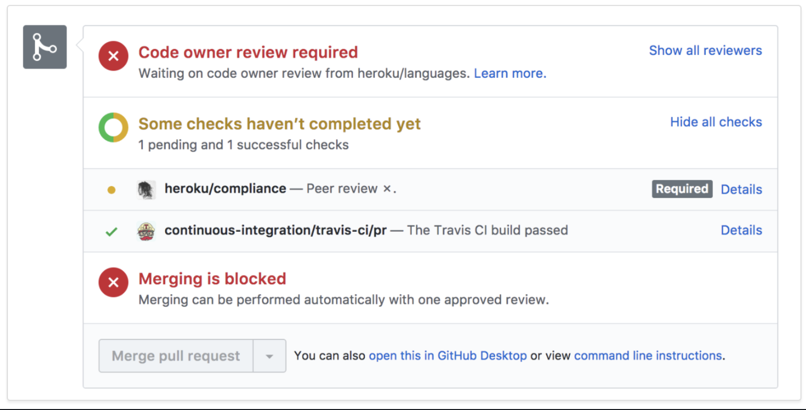
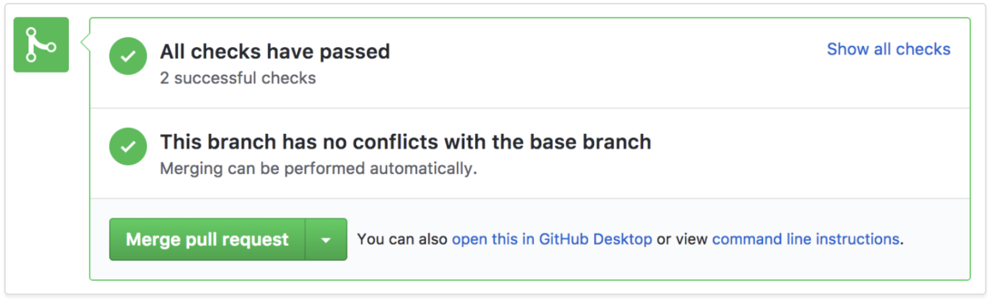

<!--Heading & logo-->
## To DOs App

[App Preview](https://ngonidukemoyo-dukeonline-wfxfj3hkd6m.ws-eu33.gitpod.io/)

## Build 
Gitpod work environment

## Purpose
This is an ecommerce website which caters to the exchange of goods and services for electronic transaction.

<!--UX & User stories-->
# User Experience
Viewing & Navigation
| Shopper | I want to be able to..| So that i can..|
|---------|-----------------------|----------------|
| Shopper 1 | view a list of products | select some to buy|
| Shopper 2 | view individual products details | See price, details, description, rating |
| Shopeer 3 | quickly identify deals, specials | special offer savings |
| Shopper 4 | easily view total of my purchase at any time | avoid spending too much |
------------------------------------------------------------------------------------
           Registration & user account                               
------------------------------------------------------------------------
| Site User | I want to be able to..| So that i can..|
|---------|-----------------------|----------------|
| Site User 5 | easily register an account | have a personalised account |
| Site User 6 | easily login and logout | acess personal account | 
| Site User 7 | easily recover password | recover access |
| Site User 8 | receive email after registration | verify account registration success |
| Site User 9 | have a personalized profile | order history and other confirmation and saved payment information |
------------------------------------------------------------------------------------------------------------
             Sorting & Searching                                                                           
------------------------------------------------------------------------------------------------------------
| Shopper | I want to be able to..| So that i can..|
|---------|-----------------------|----------------|
| Shopper 10 | sort the list of available products | easily identify best rates, prices and category sorting|
| Shopper 11 | sort specific category product | find the best price across broad categoty |
| Shopper 12 | sort multiple categories of products | find best price accross broad category |
| Shopper 13 | search for product by name or description | find a specific product |
| Shopper 14 | easily see what i have searched and number of results | quickly describe whether the product is available |
--------------------------------------------------------------------------------------------------------------------------
            Purchasing & check out                                                                                       
--------------------------------------------------------------------------------------------------------------------------
| Shopper | I want to be able to..| So that i can..|
|---------|-----------------------|----------------|
| Shopper 15 | easily select size and quantity when buying | ensure i dont select the wrong product |
| Shopper 16 | view items in my bag to be purchased | identify the total cost of my purchase and all items to be received |
| Shopper 17 | adjust the quanitty of individual items in my bag | easily make changes before check out |
| Shopper 18 | easily enter payment info | check out quick and easy |
| Shopper 19 | feel my personal info is safe | comfortably provide the needed info for purchase |
| Shopper 20 | view an order confirmation after checkout | verify that i havent made mistakes |
| Shopper 21 | receive an email confirmation after checking out | keep the confirmation of purchased items for records |
---------------------------------------------------------------------------------------------------------------------------
            Admin & store management                                                                                      
----------------------------------------------------------------------------------------------------------------------------
| Store Owner | I want to be able to..| So that i can..|
|---------|-----------------------|----------------|
| Store Owner | add a product | add new items to the store |
| Store Owner | edit or update a product | change product prices, descriptions, images aand other criteria |
| Store Owner | delete products | remove items that no longer for sale |
----------------------------------------------------------------------------------------------------------------------------

### Technologies

## Languages
1. HTML
2. CSS
3. Python
4. JSON
5. JavaScript

<!--Main Versions Requirements used in project-->
# Versions & Installation
### Django 3.2 
### Django Allauth 0.41.0 
### pip3 install Django==3.2
### pip3 django-allauth==0.41.0
### pip3 install pillow 9.0.1
### pip3 install django-crispy-forms 1.14.0
### pip3 install stripe
### pip3 install django-countries 7.2.1
### pip3 install dj_database_url
### pip3 install psycopg2-binary
### pip3 install gunicorn
### pip3 install boto3
### pip3 install django-storages

<!--Requirements-->
## Projects Requirements
### asgiref==3.5.0
### backports.zoneinfo==0.2.1
### Django==3.2
### django-allauth==0.41.0
### oauthlib==3.1.1
### python3-openid==3.2.0
### pytz==2021.3
### requests-oauthlib==1.3.0
### sqlparse==0.4.2

# Validation
### CSS base temp Validator   
### CSS profile temp Validator   
### CSS checkout temp Validator   
### HTML Validator   
### HTML Validator   
### HTML Validator   

<!--Design-->
# Color Scheme
The color scheme is more aimed at straight colors of black and white to keep the site uniformed and to grab the interest and attention with the contrast and this pattern is throughout the site to keep it seemingless and smooth.

<!--features-->
# Testing
-The site was tested on google chrome and safari.
-The site was views on mobile and large screen devices with intented functionality differences ( view, navbar and bootstrap temps)
-Alot of test done to ensure that all pages were linking correctly and no broken links

# Functional Testing
The site performs according to the requirement in all versions ( nav-bar, forms, buttons, scroll and links all functional).
The installation of the project can be done smoothly provided the user has the necessary resources and it does not lead to any significant errors (gitphun repo cloning).
The navigation between relevant modules on the site are as per the requirement (bootstrap nav-bar and toggle is fully functional).

# Deployment
## GitHub Deployment
-The project was deployed to GitHub Pages using the following steps : .Log into the GitHub and locate the GitHub Repository
.Go to settings button on the menu
.Scroll down to pages section
.under source click the dropdown named "none" and select "Master Branch"
.Scroll down through the page to find the now published link in GitHub pages section.

## Clone Project
On my repos, navigate to the main page of the repository.
Above the list of files, click Code.
To clone the repository using HTTPS, under "Clone with HTTPS", click the clipboard. To clone the repository using an SSH key, including a certificate issued by your organization's SSH certificate authority, click Use SSH, then click the clipboard. To clone a repository using GitHub CLI, click Use GitHub CLI, then click the clipboard.
Open Terminal.
Change the current working directory to the location where you want the cloned directory.
ype git clone, and then paste the URL you copied earlier.
Press Enter to create your local clone.

# Heroku deploymet
## Enabling GitHub Integration
You can configure GitHub integration in the Deploy tab of apps in the Heroku Dashboard. 

github intergration To configure GitHub integration, you have to authenticate with GitHub. You only have to do this once per Heroku account. 

Warnings After you link your Heroku app to a GitHub repo, you can selectively deploy from branches or configure auto-deploys. If you do not have any apps, you must approve integration for your organization from GitHub. For more information about this process, see Approving OAth Apps for your organization.

## Manual Deploys
With manual deploys, you can create an immediate deployment of any branch from the GitHub repo that’s connected to your app. Use manual deploys if you want to control when changes are deployed to Heroku. 

manual deploys You can also use manual deploys to temporarily deploy a branch other than the one that’s configured for automatic deployment. For example, you might have a development app synced to the development GitHub branch, but you temporarily want to test a feature branch. Simply trigger a manual deploy of the feature branch to test it on the Heroku app. Note that release of the feature branch is overwritten on the next successful GitHub push to the development branch.

## Automatic Deploys
When you enable automatic deploys for a GitHub branch, Heroku builds and deploys all pushes to that branch.You can now configure pushes to your GitHub development branch to be automatically built and deployed to that app. The App If you’ve configured your GitHub repo to use automated Continuous Integration (with Travis CI, for example), you can check the “Wait for CI to pass before deploy” checkbox. When enabled, Heroku will only auto-deploy after all the commit statuses of the relevant commit show success. This commit won’t auto-deploy because one of the checks shows a pending status: 

This commit will auto-deploy because all of the checks show a status of success:

# Performance Testing Test Cases
The various site and infrastructure bottlenecks which prevent the site to perform at the required acceptability levels has been accessed (forms and their post libraries django templates, pyhthon and django templates are functional).
The response time of the site is as per as the requirements.

# Usability Testing Test Cases
The icons are natural and consistent with the site.
The buttons, which are all fully functional and consistant throughout the site.
The text is kept simple and clear to be visible to the users.
# Compatibility Testing
The user Interface of the site is as per the screen size of the device, no text/control is partially invisible or inaccessible.
# Browser Testing
Chrome Version 95.0.4638.69 (Official Build) (x86_64)
# Manual Testing
In manual testing, test cases are executed by a human tester and software : using mainly google chrome dev tools. Test trial was exicuted by a test user to test the fucntionality of the navigation and buttons excutions for response to clicking and hovering, the response from the linking of the templates and response to clicking events, the event response to authenitcationa and registration (registration, login, verification and emails). 

Authenticatio and registration. Test trial was on the respense of the user registrations, login and verify usability.

# Bugs
1. Initially downloading django 4 but turns out it was not the appropriate version therefore some documentation was hard wired in the coge which cause the requirements like :
### pip3 install Django==3.2
### pip3 django-allauth==0.41.0
### pip3 install pillow 9.0.1
### pip3 install django-crispy-forms 1.14.0
### pip3 install stripe
### pip3 install django-countries 7.2.1

  #### Credits
  1. Code Institute Materials

  ## Content 
  1. Content was created by developer

  ## Images
  1. Images created by developer

  ## Media
  1. My Mentor for continuous helpful feedback and google for continuous research.
# code

# content
Content was created by developer
# Media
Images created by developer

# Acknowledgements
My Mentor,Student Tutoring and youtube resourcesfor continuous helpful feedback and google for continuous research

<!--Challenges faced in Project-->
  # challenges
  The authentication and registration : Getting the project to communicate with heroku to allow email sent using the proper email not printing to the terminal. (config vars)  
  Properly setting up the seperate templates to display without blocking each other as each template in django has its own handling therfore i was having a problem of the navbar blocking the forms and some functionality.

